# Architecture and module reference

This document is a detailed companion to [README.md](README.md). It describes every Python module in the repo: data flow, inputs and outputs, command-line interfaces, and **every** public or internal function (and notable classes/constants).

**Non-Python assets:** [major_award_shows.txt](major_award_shows.txt) (major ceremony names for matrix columns), [requirements.txt](requirements.txt), notebooks and other files are out of scope here unless a script reads them explicitly.

**Package layout:** All logic lives under [`oscar_predictions/`](oscar_predictions/). Repo-root `scrape_*.py`, `award_show_counts.py`, etc. are CLI shims calling `oscar_predictions.<module>.main()`. Root `oscar_scrape.py`, `award_regex.py`, and `award_groups.py` are import shims (same module object as the package submodule). See [ENTRYPOINTS.md](ENTRYPOINTS.md) and [PARITY.md](PARITY.md).

**Callable API:** Each pipeline module provides `parse_args(argv=None)`, a `run_*` function with explicit parameters (defaults match the CLI), and `main(argv=None)` that parses args and calls `run_*`.

---

## End-to-end pipeline

```mermaid
flowchart LR
  scrape_movies[scrape_movies.py]
  scrape_actors[scrape_actors.py]
  scrape_awards[scrape_actor_awards.py]
  matrix[actor_year_award_matrix.py]
  totals[film_actors_award_totals.py]
  join[join_movie_to_actor.py]
  counts[award_show_counts.py]
  movies_csv[movies.csv]
  film_actors[film_actors.csv]
  actor_awards[actor_awards.csv]
  no_award[no_award_actors.csv]
  ay_matrix[actor_year_award_matrix.csv]
  sums[film_actors_awards_sums_up_to_that_point.csv]
  movie_tot[movies_with_cast_award_totals.csv]
  show_counts[award_show_counts.csv]
  scrape_movies --> movies_csv
  scrape_movies --> film_actors
  scrape_actors --> film_actors
  scrape_actors --> no_award
  scrape_awards --> actor_awards
  scrape_awards --> no_award
  matrix --> ay_matrix
  totals --> sums
  join --> movie_tot
  counts --> show_counts
  film_actors --> scrape_awards
  film_actors --> totals
  actor_awards --> matrix
  actor_awards --> counts
  ay_matrix --> totals
  movies_csv --> scrape_actors
  movies_csv --> join
  sums --> join
```

**Shared library:** [oscar_predictions/oscar_scrape.py](oscar_predictions/oscar_scrape.py) is imported by all scrape scripts and defines CSV paths, schemas, and Playwright scraping primitives.

**Classification helpers:** [oscar_predictions/award_regex.py](oscar_predictions/award_regex.py) and [oscar_predictions/award_groups.py](oscar_predictions/award_groups.py) are imported by [oscar_predictions/actor_year_award_matrix.py](oscar_predictions/actor_year_award_matrix.py) (and `award_show_counts` uses `award_regex` indirectly via its own compiled pattern).

**Shared utilities:** [oscar_predictions/csvutil.py](oscar_predictions/csvutil.py) (CSV validation / append writers / nm-id loading), [oscar_predictions/cliutil.py](oscar_predictions/cliutil.py) (browser visibility flags).

---

## Global CSV conventions

| Constant / file | Role |
|-----------------|------|
| `CSV_FILE` → `movies.csv` | Best Picture nominee list + film-level precursor flags (see `FIELDNAMES` in `oscar_scrape`). |
| `CAST_CSV_FILE` → `film_actors.csv` | `year`, `film_title`, `actor_name`, `actor_imdb_url`. |
| `ACTOR_AWARDS_CSV_FILE` → `actor_awards.csv` | Long-form award lines per actor. |
| `NO_AWARD_ACTORS_CSV_FILE` → `no_award_actors.csv` | Actors with successful scrape but zero parsed award lines; skip list for `scrape_actor_awards`. |

**Note:** A checked-in `movies.csv` may contain extra columns (e.g. `oscar_win` for modeling labels) that are **not** written by `get_movies_for_year` / `FIELDNAMES` in `oscar_predictions/oscar_scrape.py`. Scripts that read `movies.csv` should tolerate additional columns.

---

## [oscar_predictions/oscar_scrape.py](oscar_predictions/oscar_scrape.py)

**Role:** Shared scraping library and canonical filenames/field lists for CSVs used across the project.

### Module-level constants

| Name | Value / meaning |
|------|-----------------|
| `CSV_FILE` | `"movies.csv"` |
| `CAST_CSV_FILE` | `"film_actors.csv"` |
| `CAST_FIELDNAMES` | `["year", "film_title", "actor_name", "actor_imdb_url"]` |
| `ACTOR_AWARDS_CSV_FILE` | `"actor_awards.csv"` |
| `ACTOR_AWARD_FIELDNAMES` | `["actor_name", "actor_imdb_url", "award", "year", "outcome"]` |
| `NO_AWARD_ACTORS_CSV_FILE` | `"no_award_actors.csv"` |
| `NO_AWARD_ACTORS_FIELDNAMES` | `["actor_name", "actor_imdb_url"]` |
| `FIELDNAMES` | Movie row columns written by `get_movies_for_year`: `title`, `url`, `year`, precursor nom/win pairs, `director_award_noms`, `director_award_wins` (see end of file for full ordered list). |

### Class: `AwardScrapeResult`

Frozen dataclass returned by `extract_person_award_rows`.

| Field | Type | Meaning |
|-------|------|--------|
| `rows` | `list[dict]` | Rows matching `ACTOR_AWARD_FIELDNAMES` keys (plus parsed `year` as int in dict for CSV). |
| `ok` | `bool` | `True` if page load + parse completed (including zero matching lines). `False` if missing `nm` or scrape error. |

### Functions (alphabetical by name in file order)

**`_normalize_actor_name(name: str) -> str`**  
Collapses whitespace, strips leading IMDb accessibility prefix `go to ` from link text.

**`_imdb_name_abs_url(href: str) -> str`**  
Turns a relative or absolute IMDb `/name/nm…` href into a full `https://www.imdb.com/...` URL (query string stripped).

**`_imdb_browser_context(playwright, headless: bool)`**  
Launches Chromium with automation-mitigation args, realistic user agent, viewport, locale, timezone, `Accept-Language`, and init script hiding `navigator.webdriver`. Returns `(browser, context)`.

**`get_critics_choice(browser, movie_url)`**  
Opens `{movie_url}/awards/`, selects Critics Choice in “Jump to” dropdown (`#ev0000133`), scans `li` for Best Picture + Critics Choice Award lines. Returns `{"critics_choice_nom": 0|1, "critics_choice_win": 0|1}`. On failure, returns zeros.

**`get_bafta(browser, movie_url)`**  
Same pattern for BAFTA (`#ev0000123`); matches “BAFTA Film Award”, “Best Film”, excludes “Not in the English Language”. Returns `bafta_nom`, `bafta_win`.

**`get_golden_globes(browser, movie_url)`**  
Dropdown `#ev0000292`; matches Golden Globe + Drama or Musical/Comedy Best Motion Picture. Returns `golden_globes_nom`, `golden_globes_win`.

**`get_pga(browser, movie_url)`**  
Dropdown `#ev0000531`; matches PGA / Zanuck producer award for theatrical motion pictures. Returns `pga_nom`, `pga_win`.

**`get_sag(browser, movie_url)`**  
Dropdown `#ev0000598`; expands “more” buttons in that subsection; matches SAG cast ensemble categories. Returns `sag_nom`, `sag_win`.

**`_director_nm_id_from_title_page(page)`**  
From a title page, finds first “Director” principal-credit row and returns `nm\d+` id or `None`.

**`get_director_award_counts(browser, movie_url, oscar_year)`**  
Loads title page, resolves director `nm`, opens `/name/{nm}/awards/`, counts `Winner`/`Nominee` lines whose max embedded4-digit year is ≤ `oscar_year`. Wins increment both wins and noms. Returns `director_award_noms`, `director_award_wins`. On error, zeros.

**`nm_id_from_profile_url(url: str) -> str | None`**  
Regex-extracts `nm\d+` from path (query stripped), case-insensitive.

**`remove_nm_ids_from_no_award_csv(path: str, nm_ids: set[str]) -> int`**  
Read-modify-write `NO_AWARD_ACTORS_FIELDNAMES` CSV: drop rows whose `actor_imdb_url` parses to an `nm` in `nm_ids`. Returns count of removed rows; 0 if file missing, empty `nm_ids`, or no removals.

**`extract_person_award_rows(browser, actor_imdb_url, actor_name) -> AwardScrapeResult`**  
Goes to `/name/{nm}/awards/`, iterates list items, keeps lines with Nominee/Winner, derives `year` as max 4-digit year in text, `outcome` won/nominated, `award` string from DOM (section heading prefix + text). Uses canonical profile URL in each row.

**`_pairs_from_name_links(links)`**  
Playwright locator over `a[href*="/name/nm"]`: dedupe by `nm`, normalize names, build list of dicts `nm`, `name`, `url`. Skips empty or overly long names.

**`_pull_cast_pairs_from_fullcredits_dom(page)`**  
Runs large `page.evaluate` JS: finds Cast section on fullcredits (table `cast_list`, or main sections/headings), collects unique name links, normalizes names and absolute URLs. Returns list of `{nm, name, url}`.

**`extract_film_actor_rows(browser, movie_url, year, film_title)`**  
Navigates to `.../fullcredits/`, parses cast via `_pull_cast_pairs_from_fullcredits_dom`; on empty result, retries via title page → Top Cast / Cast tab → fullcredits or top-cast links; last resort `_pairs_from_name_links` on title-cast items. Yields dicts with `CAST_FIELDNAMES` (numeric `year`, string `film_title`). On exception, returns `[]`.

**`iter_best_picture_nominees(browser, year, max_movies=None)`**  
Generator: tries IMDb Oscar event URLs for `year`, finds Best Picture testids, yields `(title, full_imdb_url, year)` for each nominee link, capped by `max_movies`.

**`get_movies_for_year(browser, year, writer, cast_writer=None, max_movies=None)`**  
For each nominee from `iter_best_picture_nominees`: optionally writes all `extract_film_actor_rows` to `cast_writer`; merges precursor + director dicts into one movie row and `writer.writerow`. Console logs intermediate counts.

---

## [oscar_predictions/scrape_movies.py](oscar_predictions/scrape_movies.py)

**Role:** CLI entrypoint to scrape Best Picture nominees and film-level awards for one or many ceremony years. Root [scrape_movies.py](scrape_movies.py) is a shim.

### Inputs

- Implicit: IMDb (network).

### Outputs

- `--csv` (default `movies.csv`): append-only `DictWriter` with `FIELDNAMES` from `oscar_scrape`.
- Unless `--no-cast`: `--csv-cast` (default `film_actors.csv`) with `CAST_FIELDNAMES`.

### CLI

| Argument | Default | Meaning |
|----------|---------|--------|
| `--year Y` | None | If set, only that year; else `2026` down to `1996` inclusive. |
| `--headless` | off | Run headless (no window). Mutually exclusive with `--headed`. |
| `--headed` | off | Open a visible window (explicit alias for default behavior). Mutually exclusive with `--headless`. |
| `--csv` | `CSV_FILE` | Movies output path. |
| `--csv-cast` | `CAST_CSV_FILE` | Cast output path. |
| `--no-cast` | False | Do not open/write cast file; only movies. |
| `--max-movies N` | None | Per-year cap forwarded to `get_movies_for_year`. |

### Functions

**`parse_args(argv=None)`** — Argparse namespace for the flags above.

**`run_scrape_movies(...)`** — Core logic (explicit parameters; defaults match CLI defaults).

**`main(argv=None)`** — `parse_args` + `run_scrape_movies`.

---

## [oscar_predictions/scrape_actors.py](oscar_predictions/scrape_actors.py)

**Role:** Fill `film_actors.csv` from `movies.csv` for films not already present (by `year` + `film_title`), and prune `no_award_actors.csv` for newly scraped cast. Root [scrape_actors.py](scrape_actors.py) is a shim.

### Inputs

- `--movies` (default `movies.csv`): requires columns `title`, `url`, `year`.
- Existing `--csv-cast` file: used to skip already-scraped `(year, film_title)` keys.

### Outputs

- Appends to `--csv-cast` (`film_actors.csv`).
- Optionally rewrites `--no-award-csv` via `remove_nm_ids_from_no_award_csv`.

### CLI

| Argument | Meaning |
|----------|--------|
| `--movies` | Input movie list. |
| `--year` | Restrict to single ceremony year. |
| `--headed` | Show browser (default headless). Mutually exclusive with `--headless`. |
| `--headless` | Run headless (default). Mutually exclusive with `--headed`. |
| `--csv-cast` | Cast CSV path. |
| `--max-movies` | Max **new** films to scrape this run. |
| `--no-award-csv` | No-award registry path. |
| `--skip-no-award-prune` | Disable removal from no-award file. |

### Functions

**`_load_existing_film_keys(path: str) -> set[tuple[str, str]]`**  
Reads cast CSV; builds set of `(str(year), film_title)` for valid integer years.

**`_load_movies_rows(movies_path: Path) -> list[dict[str, str]]`**  
Validates required columns; returns all rows as dicts.

**`parse_args(argv=None)`**, **`run_scrape_actors(...)`**, **`main(argv=None)`** — Same pattern as `scrape_movies`.

---

## [oscar_predictions/scrape_actor_awards.py](oscar_predictions/scrape_actor_awards.py)

**Role:** For each unique actor in the cast CSV, scrape IMDb person awards page; append award rows or no-award registry rows. Root [scrape_actor_awards.py](scrape_actor_awards.py) is a shim.

### Inputs

- `--input` (default `film_actors.csv`): `actor_name`, `actor_imdb_url`.
- Read for skip logic: `--output`, `--no-award-output` (existing `nm` sets).

### Outputs

- Append `--output` (`actor_awards.csv`) with `ACTOR_AWARD_FIELDNAMES`.
- Append `--no-award-output` (`no_award_actors.csv`) when scrape succeeds with zero award lines.

### CLI

| Argument | Meaning |
|----------|--------|
| `--input`, `--output`, `--no-award-output` | Paths. |
| `--force-rescrape` | Ignore skip lists (may duplicate award rows). |
| `--headed` | Visible browser. Mutually exclusive with `--headless`. |
| `--headless` | Headless browser (default). Mutually exclusive with `--headed`. |
| `--max-actors N` | Limit after filtering. |

### Functions

**`_load_unique_actors(input_path: str) -> list[tuple[str, str]]`**  
Ordered unique actors by `nm`; first occurrence wins; normalizes URL to https if needed.

Skip lists use **`oscar_predictions.csvutil.load_nm_ids_from_actor_url_column`** on `--output` and `--no-award-output`.

**`parse_args(argv=None)`**, **`run_scrape_actor_awards(...)`**, **`main(argv=None)`**  
Computes skip lists unless force; opens both CSVs in append mode; Playwright loop: `extract_person_award_rows`; on `ok` and rows, write awards; on `ok` and empty, write no-award row; on `not ok`, print message. Exits early if no actors to process.

---

## [oscar_predictions/award_regex.py](oscar_predictions/award_regex.py)

**Role:** Single source for parsing ceremony prefix from IMDb-style `award` strings in `actor_awards.csv`. Root [award_regex.py](award_regex.py) is an import shim.

### Inputs / outputs

- No CLI; imported by matrix and optionally by counts.

### Module-level

| Name | Meaning |
|------|--------|
| `CEREMONY_PATTERN` | Regex: text before ` — YYYY Winner|Nominee `. |
| `CEREMONY_RE` | Compiled pattern. |

### Functions

**`parse_ceremony(award: str) -> str | None`**  
Returns capture group 1 (ceremony name) if `award` matches `CEREMONY_RE`, else `None`.

---

## [oscar_predictions/award_groups.py](oscar_predictions/award_groups.py)

**Role:** Map non-major ceremony strings to stable `grp_*` bucket keys used in the actor-year matrix. Root [award_groups.py](award_groups.py) is an import shim.

### Module-level

**`GROUP_KEYS`**  
Tuple of slug suffixes: `prediction_online`, `us_regional_critics`, `national_critics`, `international_film`, `major_festival`, `television`, `audience_pop`, `genre`, `voice_or_animation`, `negative`, `other` (defines column order).

### Functions

**`_has_any(hay: str, needles: tuple[str, ...]) -> bool`**  
Case-insensitive substring check: any needle in `hay.lower()`.

**`classify_group(award_show: str) -> str`**  
Long if/elif chain: Razzie-like → `negative`; voice actors site → `voice_or_animation`; Emmy/TV strings → `television`; genre/horror/sci-fi awards → `genre`; named festivals / generic film festival heuristics → `major_festival`; national critics bodies → `national_critics`; online prediction communities → `prediction_online`; US regional critics patterns → `us_regional_critics`; international academies → `international_film`; teen/people’s choice/MTV/etc. → `audience_pop`; else `other`.

**`slugify_award_show(award_show: str, prefix: str, used: set[str]) -> str`**  
Lowercase, non-alphanumeric → `_`, trim, max 80 chars, prefix (`maj_` / `grp_`), dedupe with numeric suffix against `used`; adds final slug to `used`.

---

## [oscar_predictions/award_show_counts.py](oscar_predictions/award_show_counts.py)

**Role:** Frequency table of parsed ceremony names over all award rows. Root [award_show_counts.py](award_show_counts.py) is a shim.

### Inputs

- `--input` (default `actor_awards.csv`): must contain `ACTOR_AWARD_FIELDNAMES`.

### Outputs

- `--counts-out` (default `award_show_counts.csv`): columns `award_show`, `count`, sorted by descending count.

### CLI

| Argument | Meaning |
|----------|--------|
| `--pattern` | Override regex (must have one capture group); default uses `CEREMONY_RE`. |
| `--max-rows` | Stop after N data rows. |

### Functions

**`parse_args(argv=None)`**, **`run_award_show_counts(...)`**, **`main(argv=None)`**  
Streams input, matches `award` with compiled regex, `Counter` on group 1, writes sorted CSV, prints stats (distinct shows, non-matches).

---

## [oscar_predictions/actor_year_award_matrix.py](oscar_predictions/actor_year_award_matrix.py)

**Role:** Pivot `actor_awards.csv` into wide `(actor_name, actor_imdb_url, year)` rows with `maj_*_{noms,wins}` and `grp_*_{noms,wins}` integer counts. Root [actor_year_award_matrix.py](actor_year_award_matrix.py) is a shim.

### Inputs

- `--input` (default `actor_awards.csv`).
- `--major-list` (default `major_award_shows.txt`): exact ceremony strings treated as majors.

### Outputs

- `--output` (default `actor_year_award_matrix.csv`): key columns + major slug columns + all `GROUP_KEYS` pairs.

### Functions

**`load_major_award_shows(path) -> list[str]`**  
Non-empty, non-`#` lines from text file.

**`build_major_slugs(majors: list[str]) -> tuple[list[str], dict[str, str]]`**  
Ordered `maj_*` slugs via `slugify_award_show`, map ceremony → slug.

**`make_empty_row(major_slugs: list[str]) -> dict[str, int]`**  
All `maj_slug_noms/wins` and `grp_{g}_noms/wins` initialized to 0.

**`row_increment(row: dict[str, int], key: str, is_win: bool) -> None`**  
Increments `row[f"{key}_{'wins'|'noms'}"]`.

**`sum_feature_counts(row: dict[str, int]) -> int`**  
Sum of all int values in row (verification helper).

**`parse_args(argv=None)`**, **`run_actor_year_award_matrix(...)`**, **`main(argv=None)`**  
Loads majors, aggregates from award rows using `parse_ceremony` + `classify_group`, sorts keys `(year, name, url)`, writes wide CSV, warns if sum of cells ≠ matched row count.

---

## [oscar_predictions/film_actors_award_totals.py](oscar_predictions/film_actors_award_totals.py)

**Role:** For each `film_actors` row with film year `F`, attach cumulative matrix features for that actor over award years ≤ `F`. Root [film_actors_award_totals.py](film_actors_award_totals.py) is a shim.

### Inputs

- `--film-actors` (default `film_actors.csv`): must include `CAST_FIELDNAMES`.
- `--matrix` (default `actor_year_award_matrix.csv`): keys `actor_name`, `actor_imdb_url`, `year` plus feature ints.

### Outputs

- `--output` (default `film_actors_awards_sums_up_to_that_point.csv`): cast columns + same feature column names as matrix, values prefix-summed by award year.

### Functions

**`_parse_int(s: str, ctx: str) -> int`**  
Strict: empty string raises `ValueError` with `ctx`.

**`load_matrix_prefixes(matrix_path) -> tuple[list[str], dict[str, tuple[list[int], list[list[int]]]]]`**  
Per `actor_imdb_url`, merges duplicate matrix years by summing vectors, sorts years, builds running prefix sums per feature. Returns `(feature_col_names, url -> (sorted_years, prefix_vectors))`.

**`cumulative_for_film_year(prefixes, url, film_year, n_features) -> list[int]`**  
`bisect_right` on sorted award years to get last index ≤ `film_year`; returns that prefix vector or zeros.

**`parse_args(argv=None)`**, **`run_film_actors_award_totals(...)`**, **`main(argv=None)`**  
Loads prefixes, streams film_actors, writes `CAST_FIELDNAMES` + features; optional `--max-rows`.

---

## [oscar_predictions/join_movie_to_actor.py](oscar_predictions/join_movie_to_actor.py)

**Role:** One row per `movies.csv` film with summed cast `maj_*` / `grp_*` from `film_actors_awards_sums_up_to_that_point.csv`. Root [join_movie_to_actor.py](join_movie_to_actor.py) is a shim.

### Inputs

- `--movies` (default `movies.csv`): requires `title`, `year`.
- `--film-actors-sums` (default `film_actors_awards_sums_up_to_that_point.csv`): requires `year`, `film_title`.

### Outputs

- `--output` (default `movies_with_cast_award_totals.csv`): all movie columns + optional `cast_row_count` + summed features (stringified ints).

### CLI

| Argument | Meaning |
|----------|--------|
| `--inner` | Drop movies with no matching `(year, title)` aggregate. |
| `--no-cast-count` | Omit `cast_row_count`. |

### Functions

**`_parse_int_cell(s: str) -> int`**  
Loose int parse: empty → 0.

**`load_sums_aggregates(sums_path) -> tuple[list[str], dict[tuple[int, str], tuple[list[int], int]]]`**  
Feature columns = all fields except `year`, `film_title`, `actor_name`, `actor_imdb_url`. Aggregates sums and row counts per `(int year, stripped film_title)`.

**`parse_args(argv=None)`**, **`run_join_movie_to_actor(...)`**, **`main(argv=None)`**  
Loads aggregates, streams movies, left-joins (zeros if no match unless `--inner`), writes CSV.

---

## Design notes for agents / refactors

1. **Title matching:** Joins assume `movies.csv` `title` equals `film_actors` / sums `film_title` after strip (same pipeline). Mismatches yield zero aggregates in `join_movie_to_actor`.
2. **Append vs overwrite:** Scrapes append; `film_actors_award_totals`, `actor_year_award_matrix`, `join_movie_to_actor`, `award_show_counts` overwrite their primary outputs (open `"w"`).
3. **Playwright:** All browser entry uses `_imdb_browser_context`; scraping scripts need `playwright install`.
4. **Award line format:** Matrix and counts assume `award` text matches `CEREMONY_PATTERN`; unparsed lines are skipped or counted as non-matches.
