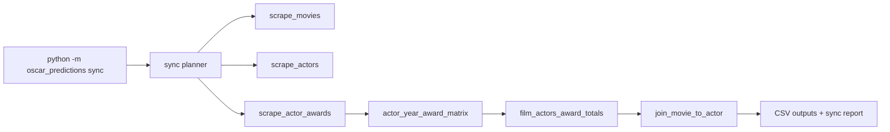

# Architecture

This project is centered on a single orchestrated command: `python3 -m oscar_predictions sync`.

## High-level flow

## Core modules

- `oscar_predictions/cli.py`
  - Defines CLI contract and `sync` arguments.
  - Converts args to a unified `SyncConfig`.
- `oscar_predictions/config.py`
  - `SyncPaths` and `SyncConfig` dataclasses.
  - One resolved source of runtime and path settings.
- `oscar_predictions/sync.py`
  - Planner + orchestration.
  - Dry-run, fail-fast/continue behavior, checkpoint state.
- `oscar_predictions/models.py`
  - `StageSummary` and `SyncReport` used by orchestrator.

## Stage modules

Each stage module has:

- `parse_args(argv=None)` for direct stage invocation,
- `run_*` for programmatic orchestration,
- `main(argv=None)` adapter.

Current stages:

- `oscar_predictions/scrape_movies.py`
- `oscar_predictions/scrape_actors.py`
- `oscar_predictions/scrape_actor_awards.py`
- `oscar_predictions/actor_year_award_matrix.py`
- `oscar_predictions/film_actors_award_totals.py`
- `oscar_predictions/join_movie_to_actor.py`
- `oscar_predictions/award_show_counts.py`

## Data contracts

Defaults:

- `movies.csv`
- `film_actors.csv`
- `actor_awards.csv`
- `no_award_actors.csv`
- `actor_year_award_matrix.csv`
- `film_actors_awards_sums_up_to_that_point.csv`
- `movies_with_cast_award_totals.csv`
- `award_show_counts.csv`

Behavior constraints:

- Scrape stages append.
- Derived stages overwrite.
- Join and grouping semantics remain unchanged from the pre-refactor pipeline logic.

## Checkpointing

- State file default: `.oscar_sync_state.json`
- Tracks completed stages for resumable runs.
- State is keyed by core input settings (year + key file paths) to avoid stale carryover.

## Public entrypoints

- Primary: `python3 -m oscar_predictions sync`

No legacy root script entrypoints or top-level shim imports are supported.
