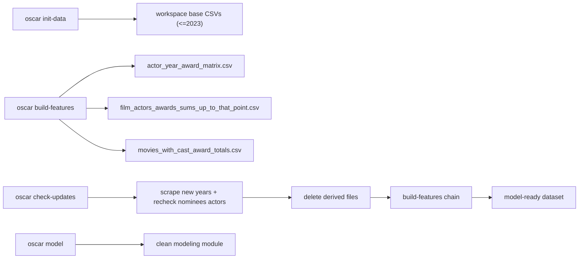

# Architecture

OscarPredictions is packaged as an installable CLI app with bundled base data.

## Command surface

Primary user commands:

- `oscar init-data`
- `oscar build-features`
- `oscar check-updates`
- `oscar model`
- `oscar sync` (legacy orchestration still available)

## Data flow

## Core modules

- `oscar_predictions/cli.py` - CLI contract and command dispatch
- `oscar_predictions/workspace.py` - workspace path management, init-data copy, derived-file cleanup
- `oscar_predictions/bundled_data.py` - package resource access for bundled data
- `oscar_predictions/features.py` - post-cleaning feature generation chain
- `oscar_predictions/updates.py` - new-year detection and refresh behavior
- `oscar_predictions/modeling.py` - production modeling pipeline
- `oscar_predictions/config.py` - sync config and workspace-to-sync path translation
- `oscar_predictions/sync.py` - orchestration/reporting for sync command

## Bundled package data

Included in wheel/sdist under `oscar_predictions/data/`:

- `data/base/movies.csv`
- `data/base/film_actors.csv`
- `data/base/actor_awards.csv`
- `data/base/no_award_actors.csv`
- `data/config/major_award_shows.txt`

## Workspace contracts

Workspace contains:

- Base files: `movies.csv`, `film_actors.csv`, `actor_awards.csv`, `no_award_actors.csv`
- Derived files: `actor_year_award_matrix.csv`, `film_actors_awards_sums_up_to_that_point.csv`, `movies_with_cast_award_totals.csv`, optional `award_show_counts.csv`
- State: `.oscar_sync_state.json`

Behavior:

- Base scraping stages append.
- Derived stages overwrite.
- `check-updates` deletes all derived files before rebuilding when new years are found.
- `check-updates` rechecks actors from newly nominated films even if they are in `no_award_actors.csv`.
